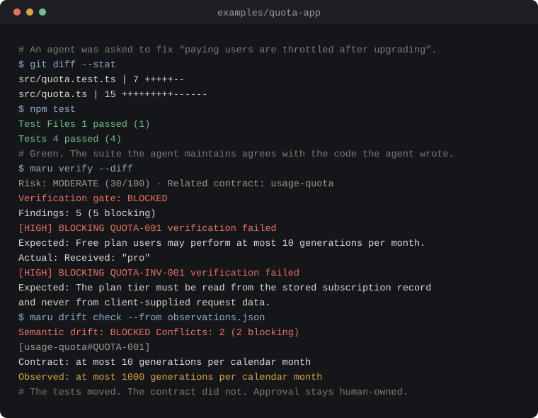

# MaruCheck

[](https://www.npmjs.com/package/marucheck)
[](https://www.npmjs.com/package/marucheck)
[](https://github.com/Kidus-M/MaruCheck/actions/workflows/ci.yml)
[](#why-node-24)
[](LICENSE)
[](docs/guides/phase-3-mcp-integration.md)

**Test what your AI didn't.** MaruCheck verifies AI-written code against a specification the AI
cannot edit. Local-first: no account, no model API key, and no code leaves your machine.

<p align="center">
  
</p>

## The failure this exists for

An agent is asked to fix a bug report: _paying users are throttled right after upgrading._ It
changes the quota code and updates the tests it owns.

```diff
  // src/quota.ts
- export const FREE_MONTHLY_GENERATION_LIMIT = 10;
+ export const FREE_MONTHLY_GENERATION_LIMIT = 1000;

- export function resolvePlan(subscription: StoredSubscription): PlanTier {
-   return subscription.plan;
+ export function resolvePlan(subscription: StoredSubscription, request?: GenerationRequest): PlanTier {
+   return request?.claimedPlan ?? subscription.plan;
  }

  // src/quota.test.ts
- it("resolves the plan from the stored subscription", () => {
+ it("honors the plan claimed by the client", () => {
```

The suite is green. The product is wrong: the free tier gives away a hundred times its quota, and
the plan tier now comes from a value the browser controls. Nothing in a normal pipeline objects,
because the same actor wrote the implementation and the thing that judges the implementation. A
passing suite proves internal consistency, not approved behavior.

MaruCheck keeps that judgment separate:

```text
$ maru verify --diff
Verification gate: BLOCKED
Findings: 5 (5 blocking)

[HIGH] BLOCKING finding-001-usage-quota-quota-001: QUOTA-001 verification failed
Expected: Free plan users may perform at most 10 generations per calendar month.
Actual:   Received: "pro"

$ maru drift check --from observations.json
Semantic drift: BLOCKED   Conflicts: 2 (2 blocking)
[usage-quota#QUOTA-001] BLOCKING
Contract: Free plan users may perform at most 10 generations per calendar month.
Observed: Free plan users may perform at most 1000 generations per calendar month.
```

Approved behavior lives in a **Quality Contract**: a human-owned, versioned file outside the code
under test. An agent can propose a change to the code. It cannot quietly move the goalposts.

## Run that example yourself

```bash
git clone https://github.com/Kidus-M/MaruCheck.git
cd MaruCheck
npm install && npm run build
node examples/quota-app/run.mjs
```

It builds a throwaway Git workspace, approves a contract, applies the agent's change, shows the
green suite, and then blocks the change — about a minute end to end. Read
[`examples/quota-app`](examples/quota-app/README.md) for what each file does and what to change to
see the gate behave differently.

## Install

Requirements: Node.js 24 LTS and npm 11 or newer ([why](#why-node-24)).

```bash
npx --yes marucheck@0.3.0 init
npx --yes marucheck@0.3.0 doctor
npx --yes marucheck@0.3.0 verify --diff
```

For regular project or team use, pin the exact public package and prevent implicit downloads:

```bash
npm install --save-dev --save-exact marucheck@0.3.0
npx --no-install maru --help
```

See the [recommended first workflow](docs/guides/recommended-first-workflow.md) before adding
hosted reporting, MCP, or a required CI gate, and the
[public installation and release guide](docs/guides/public-installation-and-release.md) for CI
pinning, manual release steps, optional trusted publishing, and rollback.

## What a run actually does

On every diff, MaruCheck scores risk deterministically, selects the requirements and tests that
this change touches, runs them locally (Vitest, Playwright, axe, Semgrep, Gitleaks), mutation-tests
to prove those tests can still fail, and compares observed behavior against protected invariants.
It remembers confirmed bugs and forces recorded regression tests back into the plan when related
code changes again. Evidence lands in `.maru/` as files you can read and argue with, not a
confidence score.

There is an [MCP server](docs/guides/phase-3-mcp-integration.md) so your agent can request
verification itself. It can ask for a verdict; it cannot grant one.

### Why Node 24

The published bundle is built for the Node 24 target and CI runs the full quality gate on Node 24
only, so that is what the `engines` field claims. Nothing in the source is known to need Node 24
specifically — the CLI has been observed running on older releases — but "not known to break" is
not verification. CI now runs an informational Node 22 job; widening the supported range once that
job is green is
[a good first issue](docs/contributing/starter-issues.md#widen-the-supported-nodejs-range).

## Repository layout

The hosted Next.js application at [marucheck.dev](https://marucheck.dev) is maintained separately
in the sibling [MaruCheck-Web](https://github.com/Kidus-M/MaruCheck-Web) repository so the CLI and
cloud product can release independently. This repository owns the local-first `maru` CLI,
verification libraries, Git analysis, Quality Contract support, and the MCP server.

Contributors changing the CLI itself build from source:

```bash
npm install
npm run check
npm run maru -- --help
```

During source development, invoke the built CLI from the project you want to inspect:

```bash
# In maru-cli
npm run build

# In a Next.js/React project
node ../maru-cli/packages/cli/dist/index.js init
node ../maru-cli/packages/cli/dist/index.js scan
node ../maru-cli/packages/cli/dist/index.js doctor
node ../maru-cli/packages/cli/dist/index.js contract create --from requirements.md
node ../maru-cli/packages/cli/dist/index.js risk --diff
node ../maru-cli/packages/cli/dist/index.js plan --diff
node ../maru-cli/packages/cli/dist/index.js verify --diff
node ../maru-cli/packages/cli/dist/index.js mutate --diff --max 20
node ../maru-cli/packages/cli/dist/index.js ci init
node ../maru-cli/packages/cli/dist/index.js mcp
```

## Commands

| Command                  | Description                                        |
| ------------------------ | -------------------------------------------------- |
| `npm run build`          | Build workspaces and the public executable bundle  |
| `npm run lint`           | Run ESLint                                         |
| `npm run format:check`   | Check formatting                                   |
| `npm run typecheck`      | Type-check all packages                            |
| `npm test`               | Run Vitest tests                                   |
| `npm run check`          | Run every local quality gate                       |
| `npm run example`        | Run the end-to-end example in `examples/quota-app` |
| `npm run release:check`  | Check code and inspect the npm tarball             |
| `npm run maru -- --help` | Exercise the workspace CLI build                   |

### Project commands

| Command                                        | Description                                                                                    |
| ---------------------------------------------- | ---------------------------------------------------------------------------------------------- |
| `maru init`                                    | Detect the stack and create an idempotent `.maru/` configuration                               |
| `maru scan`                                    | Write route, test, dependency, CI, and source inventory to `.maru/generated/project-scan.json` |
| `maru doctor`                                  | Validate Node.js, Git, package-manager, configuration, test, and CI prerequisites              |
| `maru risk --diff`                             | Score current changes with deterministic explanations                                          |
| `maru plan --diff`                             | Write an inspectable, requirement-linked verification plan                                     |
| `maru verify --diff`                           | Execute selected tests and write evidence, findings, terminal output, and JSON report          |
| `maru upload [--report <path>] [--url <host>]` | Explicitly send the newest completed report to a connected dashboard project                   |
| `maru mutate --diff [--max 20]`                | Prove selected tests reject isolated TypeScript mutations                                      |
| `maru challenge prepare/submit`                | Exchange a bounded adversarial brief with a fresh AI-client QA context                         |
| `maru ci init`                                 | Install an idempotent least-privilege GitHub pull-request workflow                             |
| `maru ci verify`                               | Verify, publish a GitHub summary, and return the ProofLayer check status                       |
| `maru drift check --from observations.json`    | Block approved semantic conflicts without rewriting the contract                               |
| `maru memory search "authorization"`           | Query historical bugs, root causes, linked files, contracts, and regression tests              |

### Quality Contract commands

| Command                                               | Description                                                  |
| ----------------------------------------------------- | ------------------------------------------------------------ |
| `maru contract create --from requirements.md`         | Create a deterministic draft from natural-language intent    |
| `maru contract list`                                  | List current contracts, states, criticality, and version IDs |
| `maru contract show <id>`                             | Print one validated contract                                 |
| `maru contract validate [path]`                       | Validate all current contracts or one YAML file              |
| `maru contract diff <id-or-path> <id-or-path>`        | Classify mechanical and semantic contract changes            |
| `maru contract approve <id> --by <accountable-owner>` | Approve and snapshot one reviewed version                    |

### Semantic drift commands

| Command                                                                           | Description                                                        |
| --------------------------------------------------------------------------------- | ------------------------------------------------------------------ |
| `maru drift check --from observations.json`                                       | Compare observed behavior with protected requirements/invariants   |
| `maru drift propose <id> --from observations.json --reason "Why" --by <proposer>` | Write an immutable pending amendment without changing the contract |
| `maru drift approve <proposal-path> --by <contract-owner>`                        | Apply a reviewed amendment with an owner approval and audit record |

### QA memory commands

| Command                                      | Description                                                  |
| -------------------------------------------- | ------------------------------------------------------------ |
| `maru memory add --from memory.json`         | Store one immutable versioned historical QA record           |
| `maru memory list`                           | List active records newest first                             |
| `maru memory search "invoice authorization"` | Search IDs, defects, root causes, paths, contracts, and tags |
| `maru memory show <MEM-id>`                  | Print one complete record including linked regression tests  |

## Repository structure

```text
packages/
|-- challenger/   # activation policy, adversarial output validation, cost, and reports
|-- ci/           # GitHub workflow installation, summaries, and check conclusions
|-- cli/          # maru command-line interface
|-- contracts/    # Quality Contract schemas and versioning
|-- core/         # verification domain and orchestration
|-- drift/        # protected expectations and contract amendment workflow
|-- evidence/     # requirement evidence, findings, gates, and reports
|-- execution/    # test, accessibility, and security adapters plus raw run artifacts
|-- git/          # repository and diff analysis
|-- mcp-server/   # coding-agent integration
|-- memory/       # historical bugs, matching, and regression links
|-- mutation/     # isolated TypeScript mutation discovery and verification
|-- planner/      # requirement-linked verification planning
|-- risk/         # deterministic risk scoring and contract matching
`-- shared/       # stable cross-package primitives
```

See [repository architecture](docs/architecture/repository-boundaries.md) and [ADR-001](docs/decisions/0001-split-cli-and-hosted-application.md) for the rationale.

## Current scope

CLI phases 0 through 10 and Phases 12 through 14 are implemented. The local CLI supports repository discovery, Quality Contract lifecycle management, MCP coding-agent integration, Git diff metadata, deterministic risk scoring, requirement-linked verification planning, local test/security/accessibility execution, isolated mutation verification, client-mediated adversarial review, evidence/findings reports, semantic drift protection, historical QA memory, and workflow-native GitHub pull-request verification.

The CLI is packaged as one public `marucheck` artifact while its internal `@maru/*` workspaces remain non-publishable implementation packages. The complete repository is available under MIT, including the CLI, verification libraries, MCP server, documentation, and examples. Versions `0.1.0`, `0.2.0`, and `0.2.2` were published before the open-source transition; `0.3.0` is the first package release that carries the MIT license. The Challenger reuses a fresh context in the user’s existing AI client, so MaruCheck needs no additional model provider, API key, or outbound request. Deterministic and existing-test workflows remain fully usable without AI or a cloud account.

Known Phase 1 limitations:

- route discovery follows common Next.js filesystem conventions and does not interpret custom runtime routing;
- doctor validates declared tooling and executables but does not install browser binaries;
- no cloud account or AI provider is used or required.

Quality Contract YAML intentionally supports the documented MaruCheck schema rather than every YAML feature. Anchors, aliases, tags, merge keys, unsafe identifiers, duplicate keys, and paths outside the project root are rejected.

See the [Phase 2 Quality Contracts guide](docs/guides/phase-2-quality-contracts.md) and the [subscription example](examples/contracts/subscription-management.yml).

### MCP server

`maru mcp` runs a local stdio MCP server for coding agents. It exposes project context, Quality Contract reads and draft creation, QA memory recording/querying, validation, bounded Git/risk/planning tools, local verification, mutation verification, and client-mediated adversarial review. It never approves contracts or makes an outbound model call. `maru_prepare_challenge` returns a bounded brief for a fresh client thread/subagent, while `maru_submit_challenge` validates the attested response.

See the [Phase 3 MCP configuration guide](docs/guides/phase-3-mcp-integration.md) for Codex, Claude Code, and Cursor setup.

### Git risk

`maru risk --diff` classifies current changes and returns a reproducible 0-100 score with explicit point contributions, related Quality Contract requirements/invariants, and recommended test categories. It works offline and does not use an LLM for scoring.

See the [Phase 4 Git risk guide](docs/guides/phase-4-git-risk.md) and [ADR-004](docs/decisions/0004-use-deterministic-metadata-risk-scoring.md).

### Verification planning

`maru plan --diff` writes a versioned `.maru/generated/verification-plan.json` connecting the current change to contract requirements, affected tests, risk-based adapter choices, uncovered requirements, and reasons for every step.

See the [Phase 5 verification planner guide](docs/guides/phase-5-verification-planner.md) and [ADR-005](docs/decisions/0005-use-versioned-traceable-verification-plans.md).

### Verification execution

`maru verify --diff` executes selected local Vitest, Playwright, axe, Semgrep, and Gitleaks work, distinguishes findings from adapter errors or unavailable work, and writes bounded raw artifacts under `.maru/artifacts/runs/`. It never downloads missing tools during verification.

See the [Phase 6 test execution guide](docs/guides/phase-6-test-execution.md) and [ADR-006](docs/decisions/0006-isolate-local-test-execution-and-preserve-raw-artifacts.md).

### Evidence and findings

Every verification run now writes `report.json` with normalized evidence, requirement mappings, deterministic severity, complete blocking findings, reproduction instructions, artifact references, and an explicit release gate. The CLI terminal view and MCP result use the same report object.

See the [Phase 7 evidence and findings guide](docs/guides/phase-7-evidence-and-findings.md) and [ADR-007](docs/decisions/0007-normalize-raw-runs-into-conservative-evidence-and-findings.md).

### Semantic drift protection

`maru drift check` compares explicit observed behavior with requirement-linked contract expectations. Approved meaning changes block without rewriting the contract. MCP clients may create an immutable pending proposal, but only a current contract owner can approve it through the separate CLI action.

See the [Phase 8 semantic drift guide](docs/guides/phase-8-semantic-drift.md) and [ADR-008](docs/decisions/0008-separate-semantic-drift-detection-proposal-and-approval.md).

### QA memory

Confirmed bugs can be stored under `.maru/memory` with their root cause, related contracts/files, tags, and regression tests. Future diffs automatically match that history, increase risk, and force available recorded regression files into verification plans.

See the [Phase 9 QA memory guide](docs/guides/phase-9-qa-memory.md) and [ADR-009](docs/decisions/0009-store-local-qa-memory-as-immutable-records.md).

### GitHub pull-request verification

`maru ci init` installs a pull-request-only workflow with read-only repository permissions. `maru ci verify` writes the evidence report and an escaped GitHub job summary before mapping the release gate to the process exit code. The workflow uploads `.maru` evidence even when a blocking contract finding fails the ProofLayer check; no GitHub App is required.

See the [Phase 10 GitHub pull-request guide](docs/guides/phase-10-github-pull-request-verification.md) and [ADR-010](docs/decisions/0010-use-workflow-native-pull-request-verification.md).

### Hosted report upload

`maru upload` is a separate opt-in network action. It finds the newest completed verification
report, loads the project-scoped connection from an ignored local file or CI secrets, and sends the
report plus Git run identity. Source files, artifact contents, and unrelated environment values
remain local. Explicit report and host flags remain available for targeted retries.

See the [hosted report guide](docs/guides/hosted-report-upload.md) and
[ADR-015](docs/decisions/0015-use-explicit-cli-hosted-report-upload.md).

### Security and accessibility adapters

UI changes can select axe-backed Playwright accessibility suites. Authentication, authorization, billing, and other security-sensitive changes select both Semgrep static analysis and Gitleaks secret scanning. Missing tools or reviewed local Semgrep rules remain explicit incomplete verification; MaruCheck does not download scanners or registry rules during a run.

See the [Phase 12 security and accessibility guide](docs/guides/phase-12-security-accessibility-adapters.md) and [ADR-011](docs/decisions/0011-run-risk-selected-local-security-and-accessibility-adapters.md).

### Mutation verification

`maru mutate --diff` tests the tests. It mirrors current committed and uncommitted files into a detached temporary Git worktree, confirms the selected Vitest/Playwright baseline passes, and then applies one bounded TypeScript mutation at a time. A mutation that survives selected tests produces `WEAK VERIFICATION DETECTED` and blocks the mutation gate. Developer source files are never rewritten.

See the [Phase 13 mutation verification guide](docs/guides/phase-13-mutation-verification.md) and [ADR-012](docs/decisions/0012-isolate-mutation-verification-in-temporary-git-worktrees.md).

### Challenger Agent

`maru challenge prepare --diff` writes a tamper-evident brief containing bounded diff metadata, protected contract intent, and relevant QA memory without source contents. Give it to a fresh thread or subagent in the AI client you already use, then pass the attested JSON envelope to `maru challenge submit --brief <brief.json> --from <response.json>`. MaruCheck validates its schema, brief hash, known files and requirements, and client-reported provenance. Hypotheses are review inputs, not findings or executable code.

See the [Phase 14 Challenger guide](docs/guides/phase-14-challenger-agent.md) and [ADR-013](docs/decisions/0013-use-client-mediated-isolated-contexts-for-challenger-reasoning.md).

## Contributing

Issues and focused pull requests are welcome, and there is a list of scoped, ready-to-pick tasks in
[starter issues](docs/contributing/starter-issues.md). [CONTRIBUTING.md](CONTRIBUTING.md) covers
setup, the exact test commands, how to add a verification check, where the CLI ends and the
verification libraries begin, and what this project will and will not accept.

## License

MaruCheck is open source under the [MIT License](LICENSE). `0.3.0` is the first npm release whose
published artifact carries that license; previously published npm versions retain the license
embedded in their immutable tarballs.
