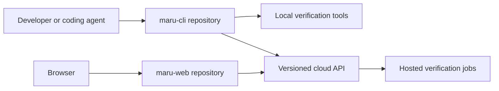

# Repository boundaries

MaruCheck is split by release lifecycle and trust boundary, not by every internal module.

## `maru-cli`

This repository owns behavior that must work locally and without an account: the `maru` executable, Quality Contracts, repository scanning, Git analysis, local verification, evidence, QA memory, and the MCP server.

Internal packages use npm workspaces because they share a release train and require atomic changes. They are packages, not independently cloned projects or nested repositories.

## `maru-web`

This separate repository owns the Next.js full-stack hosted product: dashboard UI, authenticated server routes, project management, cloud synchronization, and hosted run views. A worker becomes a separate sibling repository only when independent scaling or deployment makes that complexity worthwhile.

## Non-functional requirements

- **Local first:** CLI initialization, scanning, planning, and supported verification must not require cloud access.
- **Reproducibility:** committed lockfiles and `npm ci` are required in CI.
- **Compatibility:** cross-repository communication uses versioned schemas rather than source imports.
- **Security:** the hosted service never assumes local execution permissions; secrets must not enter evidence bundles.
- **Maintainability:** repositories release independently while tightly coupled CLI library changes remain atomic.
- **Failure isolation:** cloud unavailability degrades to local-only behavior rather than breaking the CLI.

## Known risks and mitigations

| Risk                                       | Mitigation                                                                         |
| ------------------------------------------ | ---------------------------------------------------------------------------------- |
| CLI and hosted API versions drift          | Add an explicit protocol version and compatibility tests before cloud sync ships   |
| Shared types are duplicated                | Publish a narrow versioned SDK/schema package when the API boundary is implemented |
| Too many repositories increase maintenance | Create repositories only for independently deployable or releasable products       |
| Hosted API couples to Next.js internals    | Keep transport contracts separate from route handlers and export schema artifacts  |
