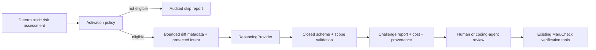

# ADR-013: Isolate adversarial reasoning behind a bounded provider protocol

## Status

Accepted

## Date

2026-08-20

## Context

The deterministic verifier can prove known requirements with selected tools, but the same plan can miss a permission abuse path, race, replay, invalid transition, timing fault, boundary condition, or partial external failure. Phase 14 adds an independent Challenger Agent whose job is to ask what ordinary verification is most likely to miss.

Adversarial reasoning is nondeterministic, can expose project context to an external model, and has variable cost. MaruCheck must remain useful offline, must not become coupled to the coding agent or one model vendor, and must never let generated prose become a contract change, release-policy change, shell command, test result, or automatically executed source file.

## Decision

Create two packages with separate responsibilities:

- `@maru/reasoning` owns a stable `ReasoningProvider` interface and a vendor-neutral JSON-over-HTTP gateway adapter.
- `@maru/challenger` owns activation, context minimization, prompts, output validation, cost policy, artifacts, and terminal output.
- The Challenger is eligible only for high/critical risk, an explicit request, or release verification.
- One run makes at most one provider call. The request carries maximum output tokens and maximum estimated cost so a gateway can enforce the budget before or during generation. Returned token usage, duration, and estimated cost are recorded.
- Remote endpoints must use HTTPS. Plain HTTP is accepted only for loopback development gateways. Credentials are sent only in an authorization header and are never written to reports.
- Provider input contains bounded Git metadata, symbols, risk reasons, historical-memory summaries, and selected contract statements. It does not contain changed source lines or arbitrary repository files.
- Provider output must match a closed schema. Requirement references must exist in the supplied context and target files must belong to the current diff.
- Output contains counterexamples and verification objectives only. It cannot contain source code, commands, contract amendments, findings, or pass/fail claims, and MaruCheck never executes it automatically.
- Hypotheses are review inputs rather than evidence-backed findings. A valid completed challenge satisfies the Challenger gate; ordinary verification must still prove or disprove the proposed cases.
- An eligible explicit run fails closed when no provider is configured, the provider fails, output is invalid, or reported cost exceeds the configured budget. A low/moderate-risk run with no explicit/release trigger is skipped without a call.
- Existing CI remains offline by default. When provider environment variables are explicitly configured, `maru ci verify` adds release-verification activation, includes the Challenger report in its summary, and fails if the Challenger gate blocks.

## Alternatives considered

### Couple directly to one provider SDK

A direct SDK would provide a shorter first integration but would make the core model, authentication, usage accounting, and error behavior provider-specific. The narrow gateway protocol lets OpenAI, Anthropic, local models, and future managed MaruCheck reasoning implement the same contract.

### Reuse the coding agent as the Challenger

The coding agent carries the assumptions that produced the implementation. Reusing the same context weakens the intended builder/verifier separation and makes cost/provenance difficult to audit. MCP clients may request the operation, but the configured `ReasoningProvider` performs the reasoning call separately.

### Send the complete patch or repository

Full source would improve code-level reasoning but creates a materially larger privacy and prompt-injection surface. Phase 14 begins with metadata and protected intent. A future source-sharing mode would require explicit consent, redaction, size limits, and a new recorded decision.

### Execute model-generated tests immediately

Generated tests are executable code and can contain unsafe or semantically incorrect behavior. Challenger output instead describes a bounded verification objective. Users or coding agents can translate a reviewed case into the existing temporary-test interface.

### Call the Challenger on every change

This would add latency, cost, and noise to low-risk work. Deterministic risk and explicit activation preserve the offline fast path.

## Consequences

- MaruCheck gains provider-neutral adversarial reasoning without making its deterministic core depend on a model service.
- Model failures and invalid output remain visible as durable blocked reports rather than disappearing into logs.
- Cost and provenance are inspectable at the run level, but estimated cost accuracy depends on the configured gateway.
- Metadata-only context can miss defects that require exact implementation details; those cases remain a documented limitation rather than silently expanding data disclosure.
- Gateway operators must implement the documented request/response protocol and enforce their provider-specific authentication, pricing, and retention policy.
