# ADR-013: Use client-mediated isolated contexts for Challenger reasoning

## Status

Accepted

## Date

2026-08-20

## Context

The deterministic verifier can prove known requirements with selected tools, but it can miss permission abuse, races, replay, invalid transitions, timing faults, boundaries, or partial external failures. The Challenger asks what ordinary verification is most likely to miss.

Most MaruCheck users already work through an AI coding client such as Codex, Claude Code, or Cursor. Adding another MaruCheck-owned LLM request would duplicate authentication, provider selection, billing, retention, and failure handling. Reusing the builder conversation directly would preserve the assumptions that produced the implementation and weaken independent review.

MaruCheck can validate an artifact and record an attestation, but an MCP server cannot prove that its host really opened a fresh thread or subagent. That limitation must be explicit.

## Decision

Use a two-step, client-mediated protocol:

```mermaid
flowchart LR
  Risk[Deterministic risk + contracts + memory] --> Prepare[MaruCheck prepares bounded brief]
  Prepare --> Client[Existing AI client]
  Client --> Isolated[Fresh thread or subagent]
  Isolated --> Envelope[Structured response + isolation attestation]
  Envelope --> Submit[MaruCheck validates hash, schema, and scope]
  Submit --> Report[Durable Challenger report]
  Report --> Verify[Reviewed verification work]
```

- `@maru/challenger` owns activation, context minimization, a closed response schema, SHA-256 brief integrity, submission validation, provenance, artifacts, and terminal output.
- The Challenger activates for high/critical risk, an explicit request, or release verification.
- `maru challenge prepare --diff` and `maru_prepare_challenge` create a bounded `brief.json`. It contains diff metadata, symbols, risk reasons, historical-memory summaries, and selected contract statements—not changed source lines or arbitrary repository files.
- The client gives the brief to a fresh thread, separate agent, or subagent without the builder conversation. The client then adds the exact brief ID/hash and truthful provenance to the returned structured result.
- `maru challenge submit` and `maru_submit_challenge` validate and persist the result. Requirement references must exist in the brief and target files must belong to its diff.
- The brief and response are limited to 1 MB. Project paths are root-bounded regular files, and each brief accepts one report.
- The report records the client, optional model, declared isolation method, attestation, and optional client-reported token/cost usage. Missing usage is recorded as `not-reported`, never zero.
- Unattested or unknown isolation blocks the Challenger gate. The report states that isolation is client-attested rather than technically proven.
- Challenger cases are hypotheses and verification objectives. They are never executed, normalized as findings, used to change a contract, or treated as proof.
- MaruCheck makes no outbound model request and needs no provider API key. Every MCP tool remains local.
- Ordinary CI stays deterministic and offline. Automatic Challenger execution is deferred because a CI process cannot open a fresh context in the user’s interactive AI client.

## Alternatives considered

### Add a provider SDK or provider-neutral reasoning gateway

This would automate server-side execution, but it would add credentials, cost controls, retention policy, provider errors, and another model relationship even though the user already has an AI client. It remains a possible future managed service, not a Phase 14 dependency.

### Reuse the builder conversation

This is convenient but not meaningfully independent. The builder context contains the same framing and assumptions the Challenger is intended to question.

### Claim that MCP enforces a separate thread

MCP can request and document the workflow, but client orchestration differs and the server cannot inspect the host’s conversation boundary. A truthful attestation is more precise than a false guarantee.

### Send the complete patch or repository

Full source could improve code-level reasoning but expands privacy and prompt-injection exposure. This phase uses bounded metadata and protected intent. A future source-sharing mode requires explicit consent, redaction, size limits, and a separate decision.

### Execute generated tests immediately

Generated tests are executable code and may be unsafe or semantically wrong. Challenger output describes verification objectives for review before existing MaruCheck execution tools are used.

## Consequences

- Users reuse the AI access they already have; MaruCheck adds no model key, provider bill, or vendor coupling.
- Builder/verifier separation is available in clients that support fresh threads or subagents and remains possible manually in other clients.
- Brief integrity, output scope, and provenance are auditable, while isolation itself remains explicitly client-attested.
- The flow has a deliberate handoff between preparation and submission.
- Fully automatic headless Challenger execution is not part of Phase 14.
- Metadata-only review can miss implementation details; that limitation is visible rather than silently broadening disclosure.
